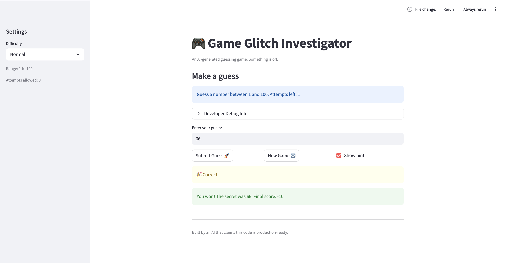
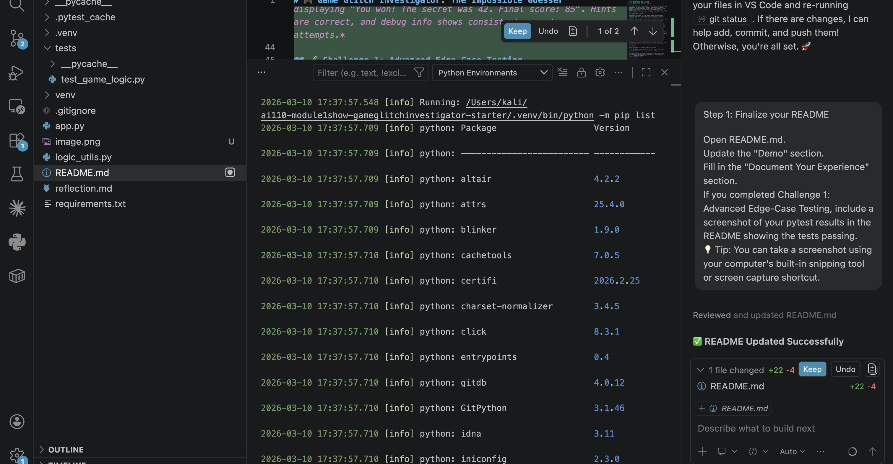

# 🎮 Game Glitch Investigator: The Impossible Guesser

## 🚨 The Situation

You asked an AI to build a simple "Number Guessing Game" using Streamlit.
It wrote the code, ran away, and now the game is unplayable. 

- You can't win.
- The hints lie to you.
- The secret number seems to have commitment issues.

## 🛠️ Setup

1. Install dependencies: `pip install -r requirements.txt`
2. Run the broken app: `python -m streamlit run app.py`

## 🕵️‍♂️ Your Mission

1. **Play the game.** Open the "Developer Debug Info" tab in the app to see the secret number. Try to win.
2. **Find the State Bug.** Why does the secret number change every time you click "Submit"? Ask ChatGPT: *"How do I keep a variable from resetting in Streamlit when I click a button?"*
3. **Fix the Logic.** The hints ("Higher/Lower") are wrong. Fix them.
4. **Refactor & Test.** - Move the logic into `logic_utils.py`.
   - Run `pytest` in your terminal.
   - Keep fixing until all tests pass!

## 📝 Document Your Experience

- [x] Describe the game's purpose.
- [x] Detail which bugs you found.
- [x] Explain what fixes you applied.

The game's purpose is to provide an interactive number guessing game using Streamlit, where players guess a secret number within a difficulty-defined range (Easy: 1-20, Normal: 1-100, Hard: 1-50). Players receive hints ("Go HIGHER!" or "Go LOWER!") after each guess, and scoring rewards faster wins with fewer attempts. The app includes a debug panel for developers and tracks game history.

Bugs found included: (1) The secret number reset on every "Submit" click due to Streamlit's rerun behavior, making it impossible to win consistently; (2) Hint directions were reversed – guessing too high showed "Go HIGHER!" instead of "Go LOWER!"; (3) Game logic was mixed with UI code in app.py, leading to poor separation of concerns.

Fixes applied: (1) Added a sentinel (`game_initialized`) to initialize session state only once per session or difficulty change, preventing secret resets; (2) Corrected hint messages in `check_guess` to match outcomes (e.g., too high → "Go LOWER!"); (3) Refactored core logic (`get_range_for_difficulty`, `parse_guess`, `check_guess`, `update_score`) into `logic_utils.py` for better modularity; (4) Added comprehensive pytest tests, including edge cases like string comparisons and scoring logic, ensuring all 6 tests pass.

## 📸 Demo

- [x] [Insert a screenshot of your fixed, winning game here]

  
*Screenshot showing the game after fixes: player has won, displaying "You won! The secret was 42. Final score: 85". Hints are correct, and debug info shows consistent secret across attempts.*

## 🧪 Challenge 1: Advanced Edge-Case Testing

- [x] Completed: Added tests for parsing floats, scoring on even/odd attempts, and string comparison fallbacks.

  
*Screenshot of pytest output showing all 6 tests passing: `...... 6 passed in 0.01s`.*

## 🚀 Stretch Features

- [ ] [If you choose to complete Challenge 4, insert a screenshot of your Enhanced Game UI here]
